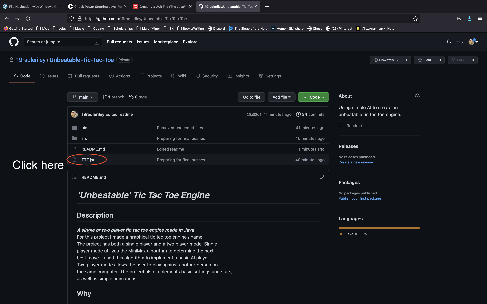
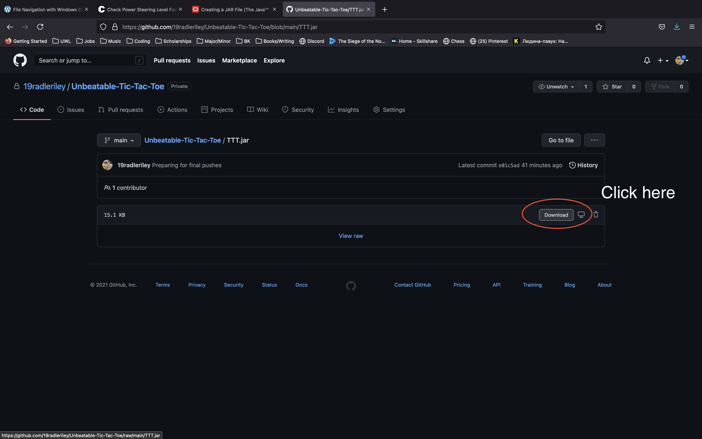
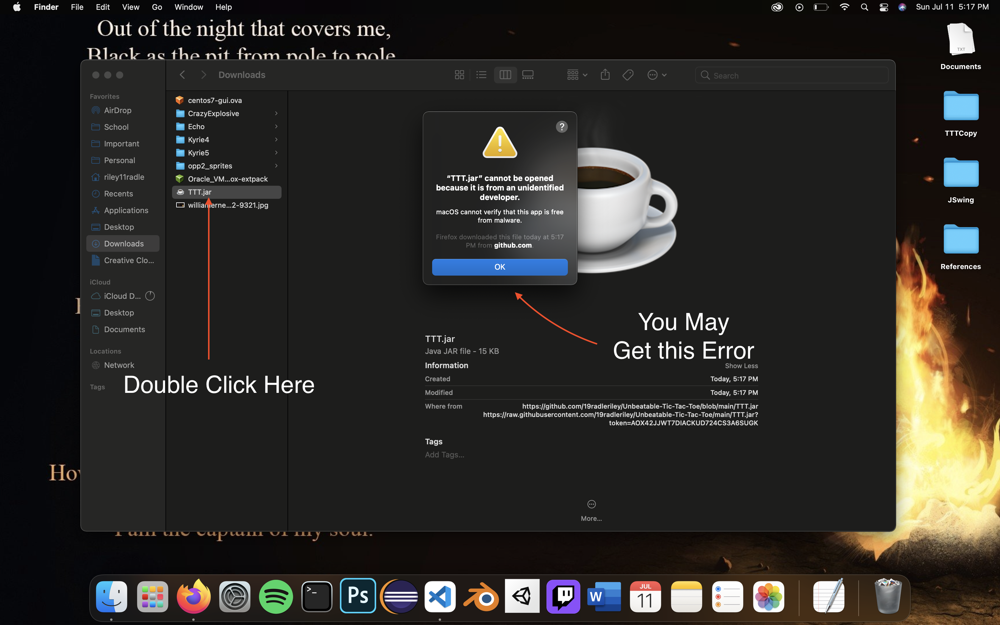
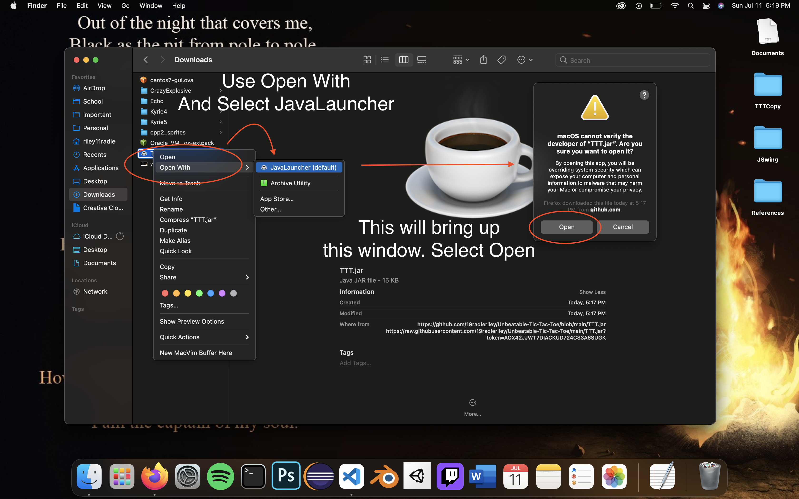
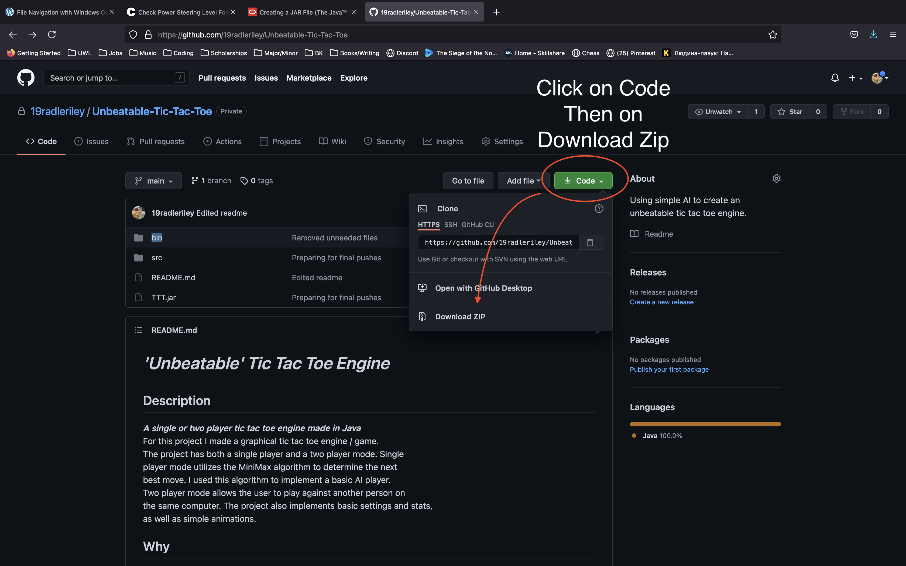
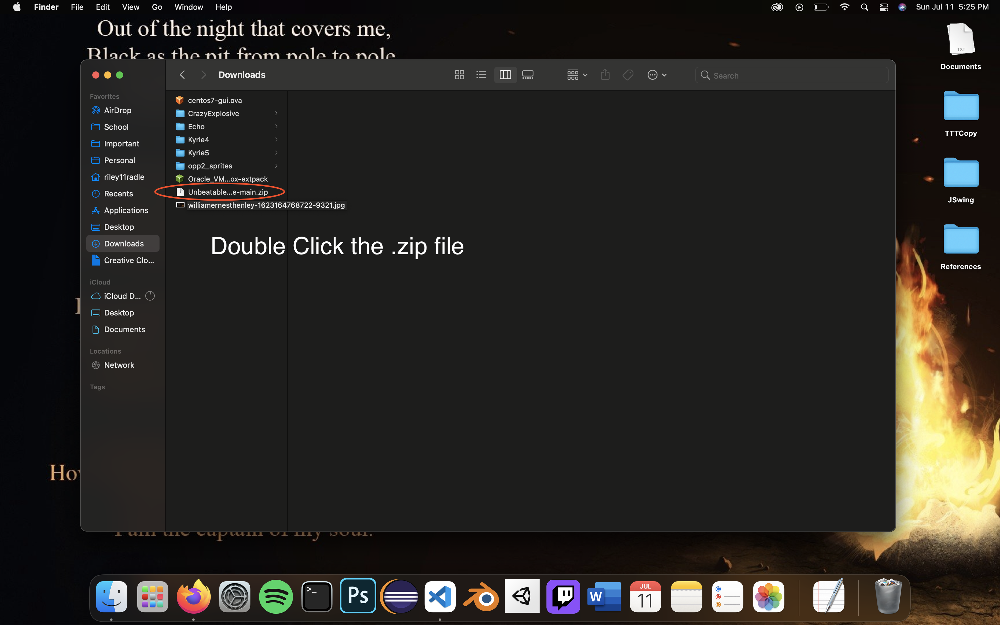
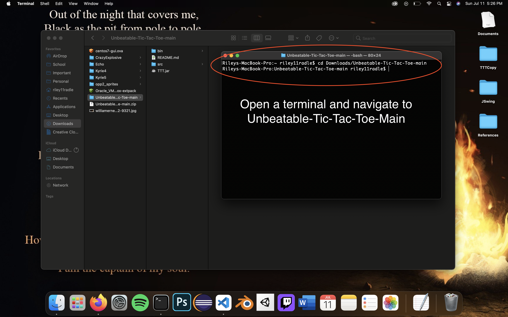
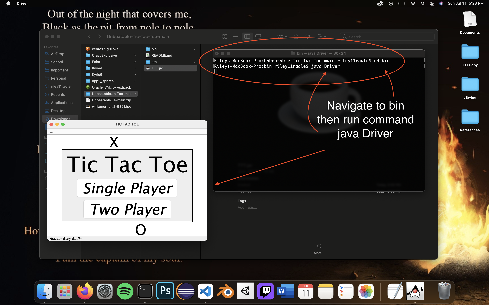

# *'Unbeatable' Tic Tac Toe Engine*

## Description
__*A single or two player tic tac toe engine made in Java*__  
For this project I made a graphical tic tac toe engine / game.  
The project has both a single player and a two player mode.  Single  
player mode utilizes the MiniMax algorithm to determine the next  
best move.  I used this algorithm to implement a basic AI player.  
Two player mode allows the user to play against another person on  
the same computer. The project also implements basic settings and stats,  
as well as simple animations. 

## Why
I chose to create this project for a couple of reasons. First, I have always  
been interesting in making games, and this strengthened my fundamental skills  
for game development.  On top of this, it allowed me to demonstrate my knowledge  
of Java, which is the language I have the most experience in.  

## Resources used  
- Java
- JSwing

# **Running / Viewing the Project**
## JAR File (Recommended / Simplest)
1. Download the TTT.jar file from the repository.  
2. Move the TTT.jar file into a file other than "Downloads" or "Desktop"  
(This will allow for your settings and stats to be saved across multiple runs of the application).
2. Double click on the TTT.jar file to run the project.  
## Command Line
1. Download the project 
2. Open a terminal / command prompt 
3. Navigate to the downloaded 'bin' folder (if unfamiliar with how to do this see the references below)  
Linux and Max: http://mally.stanford.edu/~sr/computing/basic-unix.html  
Windows: https://blogs.umass.edu/Techbytes/2014/11/14/file-navigation-with-windows-command-prompt/ 

4. Type and run the following command from inside of the 'bin' folder:  
java Driver  

# Examples / Screenshots  
## Running from TTT.jar

**NOTE**: You need java in order to run .jar files

## Running from Command Line

# Future Add Ons  
1. Add more settings that allow the user to further customize their games
2. Add color themes allowing the user to change the look of the project
3. Use a more efficient algorithm than MiniMax
4. Add support for games on boards larger than 3x3
5. Add music to the application

   

<small>  

__*@Author: Riley Radle*__  
Check out my socials!  
*Instagram*: https://www.instagram.com/riley_radle/  
*Artstation*: https://www.artstation.com/radle2279/    
*Linkedin*: https://www.linkedin.com/in/riley-radle-00a4a0184/

</small>
